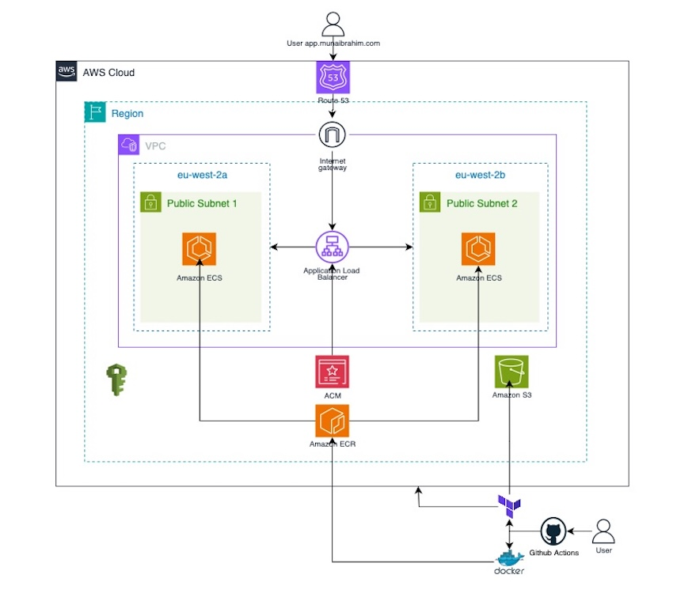

# Threat modelling tool
This project deploys a containerised application to **AWS ECS Fargate** using **Terraform**, with end-to-end automation via **GitHub Actions**.

##  Architechture diagram

  

## Features

- Fully automated infrastructure using Terraform
- Docker container pushed to Amazon ECR
- ECS Fargate service behind an ALB with HTTPS
- SSL certificate issued via ACM and validated through Route 53
- GitHub Actions workflows for:
- Docker image build & push
- Terraform plan, apply, and destroy

## Project Structure
<pre>
./
├── app/
├── Dockerfile
├── terraform/
│   ├── main.tf
│   ├── provider.tf
│   ├── variables.tf
│   └── modules/
│       ├── acm/
│       ├── alb/
│       ├── ecs_fargate/
│       ├── iam/
│       ├── route53/
│       ├── security_groups/
│       └── vpc/
└── .github/
    └── workflows/
        ├── apply.yml
        ├── destroy.yml
        ├── docker.yml
        └── plan.yml

</pre>

## Local App Setup 💻
### Option 1: Run Locally Without Docker
<pre>
yarn install
yarn build
yarn global add serve
serve -s build
</pre>
Then visit: http://localhost:3000

### Option 2: Run Using Docker
<pre>
docker build -t my-app .
docker run -p 3000:3000 my-app
</pre>
Then visit: http://localhost:3000

## Deployment Workflow
### Docker Build and Push
- Builds the Docker image
- Performs a security scan using Trivy
- Pushes the image to Amazon ECR
- Deploys latest image to ECS

### Terraform Plan
- Executes terraform init and terraform plan
- Validates the configuration with TFLint
- Conducts a security analysis using Checkov

### Terraform Apply
- Applies the Terraform configuration to provision or update AWS resources
- Includes setup of the ALB, ECS, IAM, VPC Route 53 DNS records, and ACM certificate

###Terraform Destroy
- Destroys all infrastructure managed by Terraform when no longer required